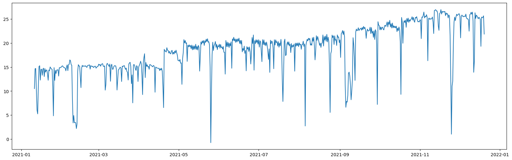
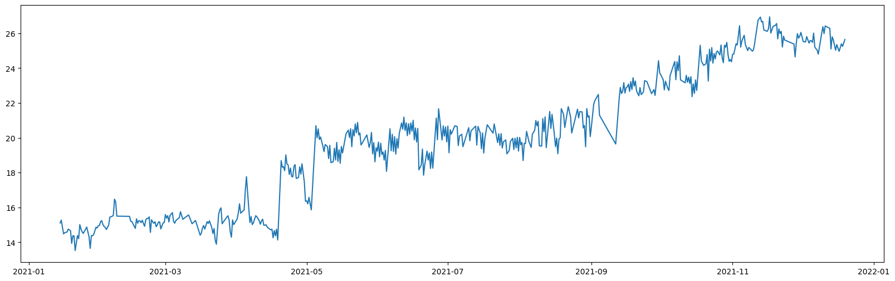
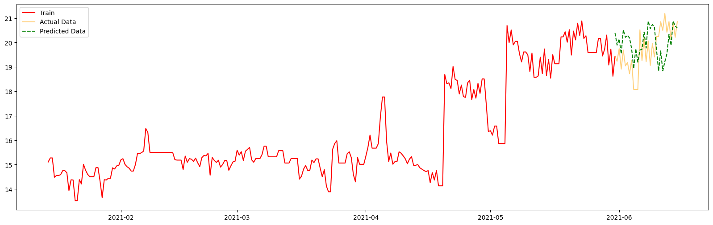

# Time Series Forecasting Project

Welcome to the Time Series Forecasting project! This repository contains an implementation of various statistical and machine learning methods to analyze and forecast time series data. The focus of this project is to explore, preprocess, and model time series data using established techniques such as ARIMA, SARIMA, and AutoARIMA. Additionally, statistical tools such as ACF (Autocorrelation Function) and PACF (Partial Autocorrelation Function) for model parameters, IQR and boxplots to detremine outliers detection and removals

## Project Overview
Time series forecasting is a crucial technique in many industries for tasks such as demand planning, stock market analysis, and resource optimization.
This project aims to provide a comprehensive approach to handling and forecasting time series data, from data preprocessing to model evaluation.

### Key Features:
- **Algorithms Used:**
  - ARIMA (Auto-Regressive Integrated Moving Average)
  - SARIMA (Seasonal Auto-Regressive Integrated Moving Average)
  - AutoARIMA (Automatic selection of ARIMA parameters)
- **Statistical Analysis:**
  - ACF and PACF plots for identifying AR and MA terms
  - Outlier detection using IQR and other statistical techniques
- **Preprocessing Steps:**
  - Handling missing values
  - Seasonal decomposition
  - Scaling and transformations

## Methodology
1. **Exploratory Data Analysis (EDA):**
   - Visualize the time series to identify trends, seasonality, and irregularities.
   - Use ACF and PACF plots to determine lag values.

2. **Outlier Detection and Handling:**
   - Use IQR to detect and remove extreme values.
   - Apply statistical transformations using IQR and some more statistical measures.
**Data Contains Outliers**

**Data After removing Outliers**

3. **Modeling:**
   - Use ARIMA/SARIMA to model and forecast the time series.
   - Employ AutoARIMA for automated parameter selection.

4. **Evaluation:**
   - Compare models using metrics such as MAE, RMSE, and MAPE.
   - Visualize residuals to ensure no patterns remain.

   

## Contributing
Contributions are welcome! Feel free to fork this repository, make changes, and submit a pull request. For major changes, please open an issue first to discuss what you would like to change.

## Contact
For any questions or feedback, please contact:
- **Name:** Atharva Hatekar
- **Email:** atharva_hatekar@yahoo.in
- **GitHub:** [atharvahatekar](https://github.com/atharvahatekar)

---
Thank you for exploring this project! I hope it serves as a valuable resource for your time series forecasting endeavors.
